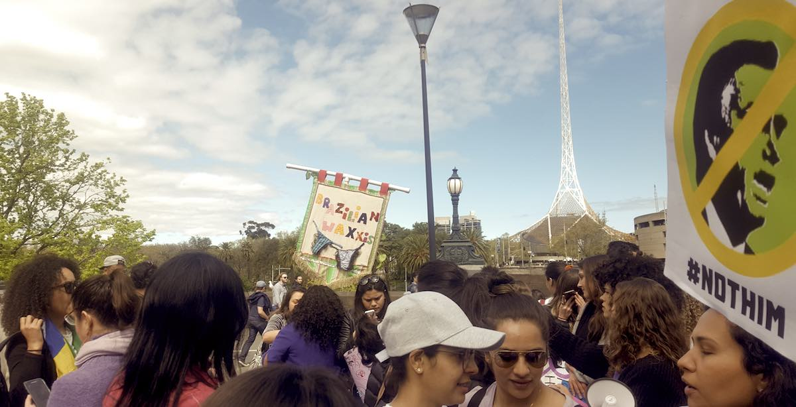
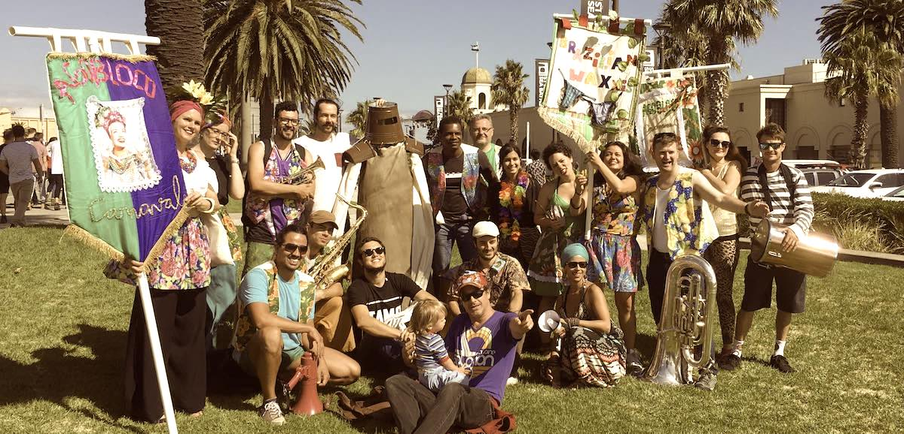

## Brazilian WAXxx
Created in 2016 by two Brazilian women “Brazilian WAXxx” is a “bloco”
(a street parade singing a theme song) bringing Brazilian street Carnaval
culture to Brunswick, Melbourne. This ‘Bloco’ aims to provoke reflection
around ‘why we associate Brazil with intimate waxing services?’ ‘Are
Brazilian women expected to be bare down under?’
How did it come to be that the name of an entire nation be rendered
synonymous to complete intimate hair removal?
‘SAVE THE BRAZILIAN AMAZON’ is the first original song composed for
the ‘bloco’. In an ironic way we raise the discussion about the criminal
deforestation occurring every day in forests around the world, relating
this to the cultural nonsense of assuming that a woman should keep her
wetlands totally deforested.
Perhaps people could pay more attention to the Earth’s wellbeing than
making assumptions about a woman’s pubic hair.

The song is a direct manifesto about the choice of keeping the lush
forests in our wetlands.

  

    <h2>Marchinha</h2>
    

    Salve, salve, salve a Amazônia brasileira 
    Salve, salve, salve a Amazônia brasileira
    

    

    No matagal, não mexe não  
    Sendo vai dar uma puta confusão  
    Mas a mocinha, pode aparar  
    Poe biquininho e vai na praia pra nadar  
    

    

    Salve, salve, salve a Amazônia brasileira 
    Salve, salve, salve a Amazônia brasileira
    

    

    Quando eu te falo, sou brasileira  
    Sua cabeça fica cheia de besteira  
    Mas meu amigo, que cara eh essa?  
    Não tenho tempo pra esse tipo de conversa  
    

    

    Salve, salve, salve a Amazônia brasileira 
    Salve, salve, salve a Amazônia brasileira
    

    

    Toda mulher que tem joelho  
    Tambem vai ter um bocado de pentelho  
    O meu amigo, deixa de besteira  
    Tem muito mato na Amazônia brasileira  
    

    

    Salve, salve, salve a Amazônia brasileira 
    Salve, salve, salve a Amazônia brasileira
    

    

    Gillete? Não! Com cera? Não!  
    Isso é uma questão de opinião.  
    Gillete? Não! Com cera? Não!  
    Até sem desmatamento da tesão
    

    

    Salve, salve, salve a Amazônia brasileira 
    Salve, salve, salve a Amazônia brasileira
    

  

  

    <h2>Marchinha</h2>
    

    Save, save, save the Amazon 
    Save, save, save the Amazon
    

    

    Do not mess with the forest 
    Or it will give you big trouble 
    But a young lady, she can trim 
    Put on a little bikini and go to the beach to swim 
    

    

    Save, save, save the Amazon 
    Save, save, save the Amazon
    

    

    When I tell you, "I'm Brazilian" 
    Your head fills with bullshit 
    And my friend, what kind of look is that? 
    I do not have time for this kind of conversation 
    

    

    Save, save, save the Amazon 
    Save, save, save the Amazon
    

    

    Every woman who has a knee 
    She’ll also have a lot of pubes 
    My friend, stop fooling around 
    There are a lot of weeds in the Brazilian forest
    

    

    Save, save, save the Amazon 
    Save, save, save the Amazon
    

    

    To shave? No !!! Waxing? No !!!  
    It’s a matter of opinion 
    To shave? No !!! Waxing? No !!! 
    Even without deforestation it’ll turn you on !
    

    

    Save, save, save the Amazon 
    Save, save, save the Amazon
    

  

  

    

      

      Song by Marcelo Garcia, Julia Calasso &amp; Mariane Gonçalves  
      Horns Arrangement by Manga Moraes
    

  

  
  <figure class=" col-lg-6 col-md-6">
      
  </figure>
  <figure class=" col-lg-6 col-md-6">
      
  </figure>
  <figure class=" col-lg-12 col-md-12">
      
  </figure>

    

## Cast and Creatives

<dl class="row">
  <dt class="col-6">Bloco founders</dt>
  <dd class="col-6">Mariane Gonçalves, Julia Calasso</dd>

  <dt class="col-6">Crew</dt>
  <dd class="col-6">João Oliveria, Marcelo Garcia, Alysson Costa, Tiago Ucella, Luciana Carvalho, Rob Bain, Alex Childs, Sophie Dahm</dd>
</dl>