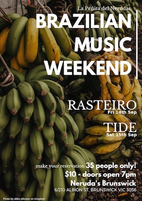

## Engaging with local community

On 15th & 16th September 2018 
Always Uneven in partnership with [Neruda's Brunskick](http://www.cafenerudas.com.au) put together the ‘Brazilian Weekend’ with live music, South American empanadas, beer and wine. 
The guitar duo Rasteiro played on Saturday their originals songs and some Brazilian Bossa Nova with a jazzy flavour. For this gig Maurizio Gulina and Marcelo Garcia invited Tiago Ucella and Julia Calasso to play percussion alongside them. 
[More about Rasteiro](https://www.facebook.com/rasteiromusic/)

On Sunday we had Tide performing his solo project. Tide is a very talented guitarist player and lead singer of the bands, ‘Rua’ & ‘Vento Pipa’. In his solo project he uses a wide range of percussive instruments and a loop pedal to accompany his guitar and voice. The result is an organic and authentic style of Brazilian music.
[More about Tide](www.tideneto.com)

---

 

  <figure class=" col-lg-6 col-md-6">
      
  </figure>
  <figure class=" col-lg-6 col-md-6">
  	  
  </figure>
  <figure class=" col-lg-6 col-md-6">
      
  </figure>
  <figure class=" col-lg-6 col-md-6">
	  
  </figure>

---  
<h2 class="content-subhead">Cast and Creatives</h2>     

<dl class="row">

  <dt class="col-6">Photographer</dt>
  <dd class="col-6">Igor Dallegrave, Tiago Brissos, Daniela Sönksen</dd>

  <dt class="col-6">Musicians</dt>
  <dd class="col-6">Marcelo Garcia, Maurizio Gulina, Julia Calasso, Tiago Ucella, Tide</dd>

  <dt class="col-6">Sound Engineer</dt>
  <dd class="col-6">Alcides Neto</dd>

</dl>

