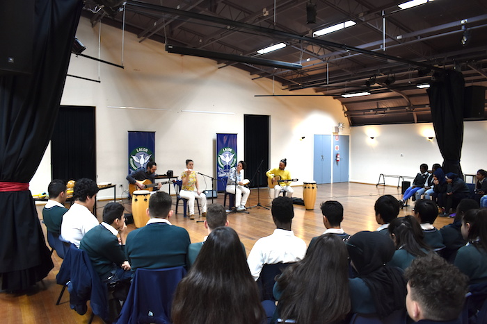
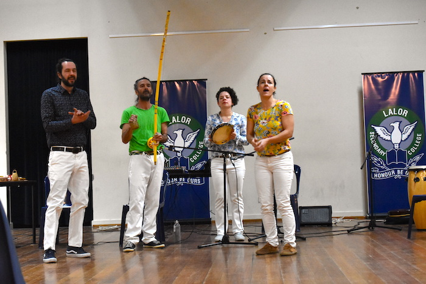

Camará Project is a cultural performance that presents some of the traditional Brazilian rhythms and dances such as Bossa Nova, Samba, Samba de Roda & Baião and the Brazilian martial art ‘Capoeira’.

The show was firstly designed to be performed in schools, aiming to share with students and teacher a bit of the Brazilian Culture.
Camará group begins the performance sharing some historical aspects of Capoeira, Samba de Roda and Bossa Nova history, and introducing musical instruments that are part of those rhythms, such as berimbau, agogo and pandeiro. After that it is time to teaches some songs, and movements to the audience.

At one point of the performance, audience is invited to participate in the show. 

Joy and fun are key elements in the interaction!
 
The word camará means chap, mate, bud and this term has been used in the Capoeira context. 
 
Performing in schools is an important opportunity to the group as a way to show Brazilian Culture as it deserves, but the project is not restricted to that. 
Performance can take place in festivals and other cultural activities.
 
Axé Camará! 
 

 

  <figure class=" col-lg-6 col-md-6">
      
  </figure>
  <figure class=" col-lg-6 col-md-6">
      
  </figure>

