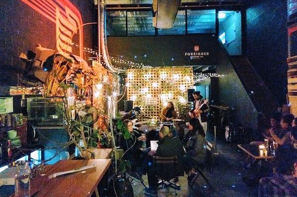

<figure class="figure float-right ml-3 mb-3">
  
  <figcaption class="figure-caption mt-1">Photo by Igor Dallegrave</figcaption>
</figure>

Pandemic has been challenging for everyone. 
We crave for human interaction, live performances, art, hugs...  

So, in between lockdowns we thought life was is getting back to normal... and what could be better than celebrate that with first class live music and amazing beer? 

That was Destination; a safe and intimate little concert for 20 people.   

Tide trio brought their amazing foreigner-funky-disco-latin-jazz vibes to the Foreigner Brewery.    

    
 <h2 class="content-subhead">Cast and Creatives</h2>     

<dl class="row">
  <dt class="col-6">Producer &amp; Artistic Director</dt>
  <dd class="col-6">Julia Calasso &amp; Marcelo Garcia</dd>

  <dt class="col-6">Photographer</dt>
  <dd class="col-6">Kyky Rodrigues</dd>

  <dt class="col-6">Musicians</dt>
  <dd class="col-6">Tide Neto, Ettore Sanfalice, Igor Dellagrave</dd>

  <dt class="col-6">Sound Engineer</dt>
  <dd class="col-6">Alcides Neto</dd>

</dl>

