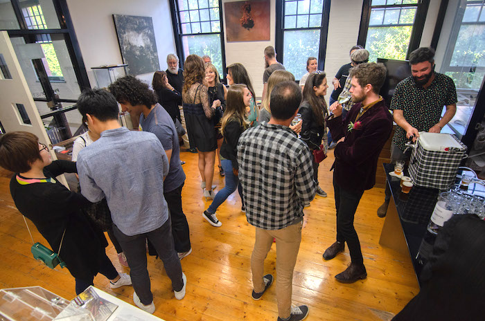
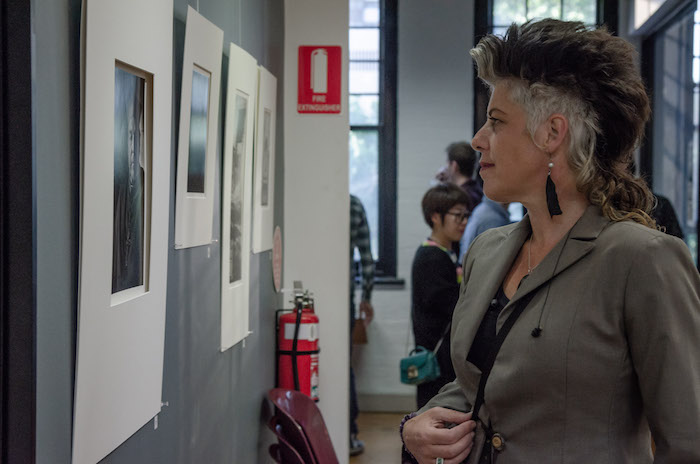
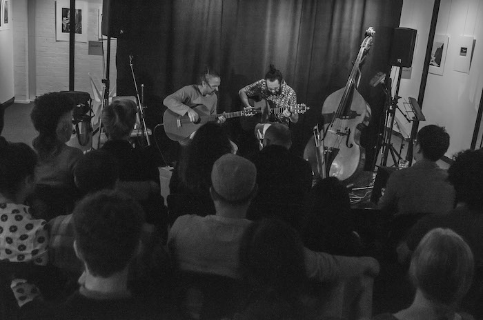
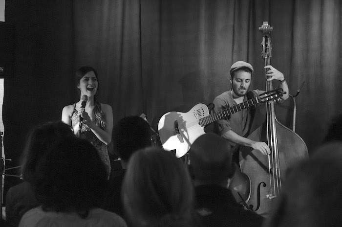

<figure class="figure float-right ml-3 mb-3">
  
  <figcaption class="figure-caption mt-1">Photo by Igor Dallegrave</figcaption>
</figure>

## 17th November 2018 

Always Uneven in partnership with Magnet Gallery presented the astonishing Italo-Colombian duo Transatlantico supported by the talented duo Rasteiro. 
Live music established a dialogue to the photo exhibition 'Double Vision' by the well-known photographers David Roberts and Jeremy Rabie. 

## TransAtlantico

Transatlantico is an Italo-Colombian duo, which explores diverse rhythms from Latin-American. The members are a talented Colombian singer and an exceptional Italian guitarist/double-bass player who will merge the two with a loop-station. 

The repertoire made of originals and classics travels from Latin jazz, to root south American rhythms such as Colombian and Cuban classics. Transatlantico explores new sonorities and experiments how deep the interaction between two musicians can be.

## Rasteiro

With soul shooting global melodies, Rasteiro is a musical project with the aim of composing original works and performing them together with Brazilian standards of Bossa Nova, Samba, Baiao and more. Rasteiro is formed by Maurizio Gulina and Marcelo Garcia. Like a conversation they just play. At the end of the day the music says it all.
   

  <figure class=" col-lg-12 col-md-12">
      
  </figure>
  <figure class=" col-lg-6 col-md-6">
      
  </figure>
  <figure class=" col-lg-6 col-md-6">
      
  </figure>
  <figure class=" col-lg-6 col-md-6">
      
  </figure>
  <figure class=" col-lg-6 col-md-6">
      
  </figure>
  <figure class=" col-lg-6 col-md-6">
      
  </figure>
  <figure class=" col-lg-6 col-md-6">
      
  </figure>
  <figure class=" col-lg-6 col-md-6">
      
  </figure>
  <figure class=" col-lg-6 col-md-6">
      
  </figure>
  

    

      Photography: Igor Dallegrave
    

  

    
 <h2 class="content-subhead">Cast and Creatives</h2>     

<dl class="row">
  <dt class="col-6">Concept &amp; Director</dt>
  <dd class="col-6">Julia Calasso</dd>

  <dt class="col-6">Photographer</dt>
  <dd class="col-6">Igor Dallegrave</dd>

  <dt class="col-6">Musicians</dt>
  <dd class="col-6">Marcelo Garcia, Maurizio Gulina, Julia Calasso, Tiago Ucella, Stefano Vespucci, Clarens Sanchez</dd>

  <dt class="col-6">Sound Engineer</dt>
  <dd class="col-6">Alcides Neto</dd>

</dl>

