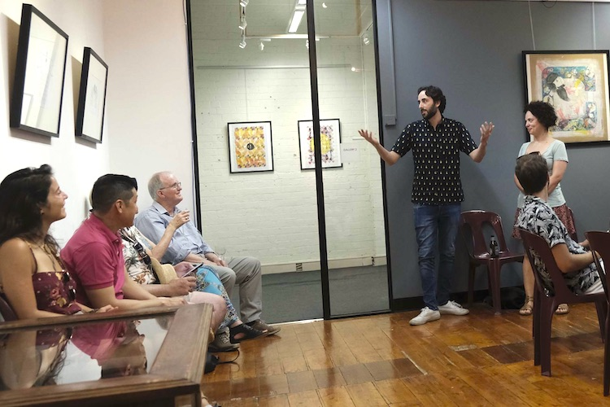
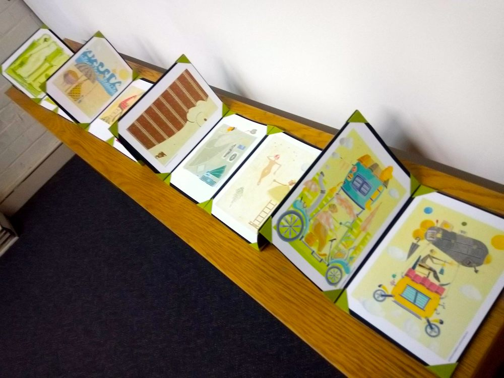
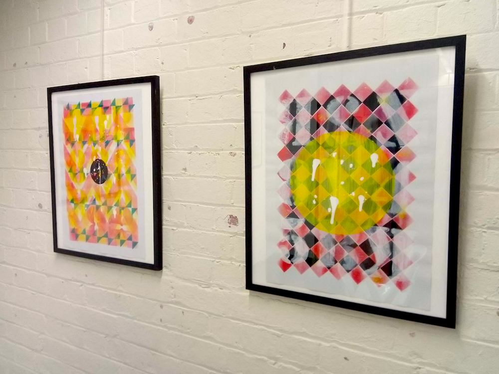
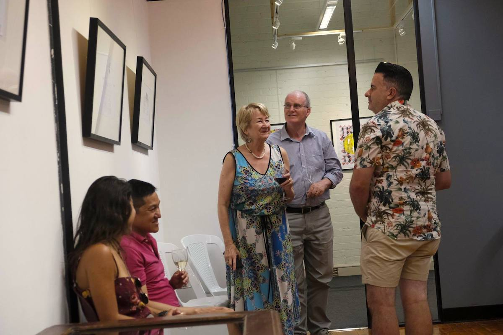
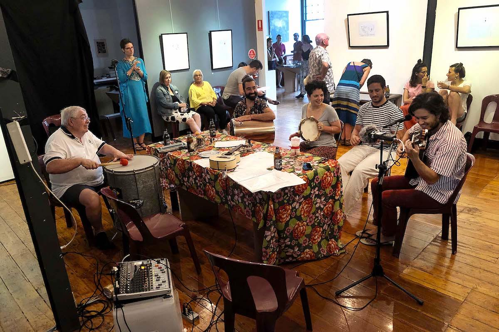
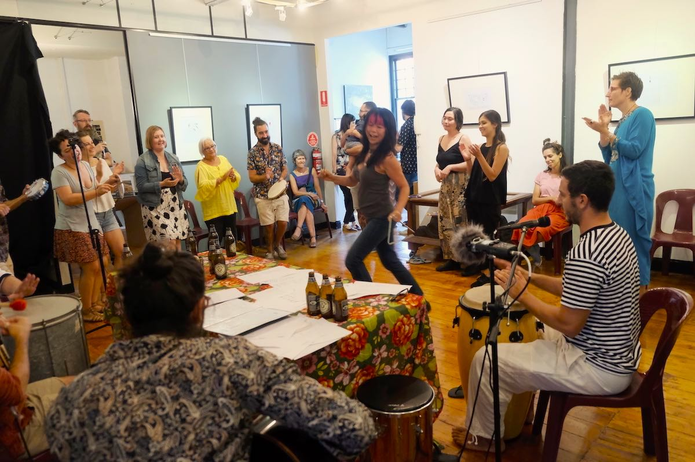
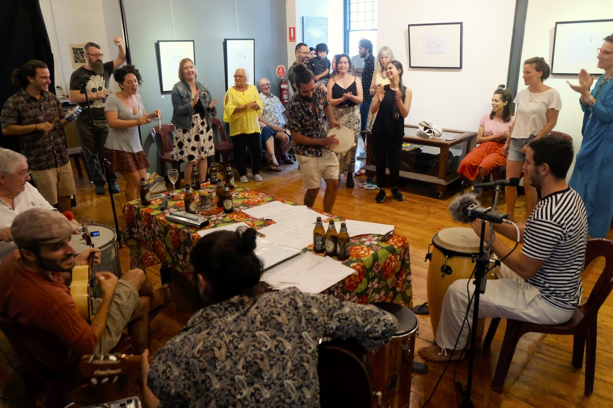

## 24th February 2019  - Its Samba Time

In this second edition, Always Uneven in partnership with Magnet Gallery put together a Brazilian ‘Roda de Samba’ for the Melbourne community. 

‘Roda de Samba’ is a samba jam session that usually happens in bars all around Brazil. This a special time for the sambistas to get together and play samba.  

## Gustavo Cristoofaro

Enriching the samba experience, we had an art exhibition by Gustavo Cristoofaro. Gustavo started his journey in the art world of his native Brazil many years ago. He enjoys exploring a range of different medias such as pen, pencils, ink, watercolours, acrylic, collage and even Lego in his art production. 
It is intriguing to see how he blends different elements in his art to present an understanding of the world around him. 
 

  
  <figure class=" col-lg-6 col-md-6">
      
  </figure>
  <figure class=" col-lg-6 col-md-6">
      
  </figure>
  <figure class=" col-lg-6 col-md-6">
      
  </figure>
  <figure class=" col-lg-6 col-md-6">
      
  </figure>
  <figure class=" col-lg-6 col-md-6">
      
  </figure>
  <figure class=" col-lg-6 col-md-6">
      
  </figure>
    

    

      Photography: Michael Silver
    

  

    
 <h2 class="content-subhead">Cast and Creatives</h2>     

<dl class="row">
  <dt class="col-6">Concept &amp; Director</dt>
  <dd class="col-6">Julia Calasso</dd>

  <dt class="col-6">Photographer</dt>
  <dd class="col-6">Michael Silver</dd>

  <dt class="col-6">Musicians</dt>
  <dd class="col-6">Damiano Spina, Stefano Vespucci, Tiago Ucella, Marcelo Garcia, Maurizio Gulina, Julia Calasso, Tide, Gabriel Marinho, Renan Santos, Clarens Sanches, Imogen Pemberton</dd>

  <dt class="col-6">Sound Engineer</dt>
  <dd class="col-6">Alcides Neto</dd>

</dl>

