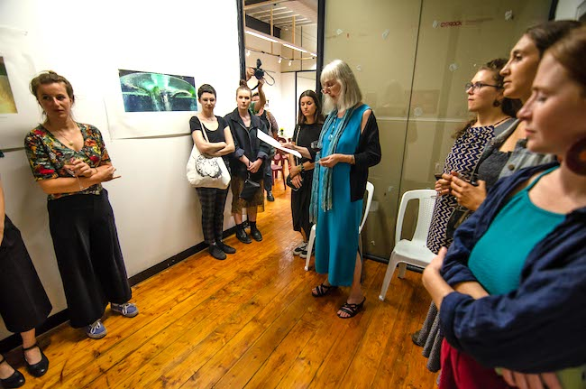
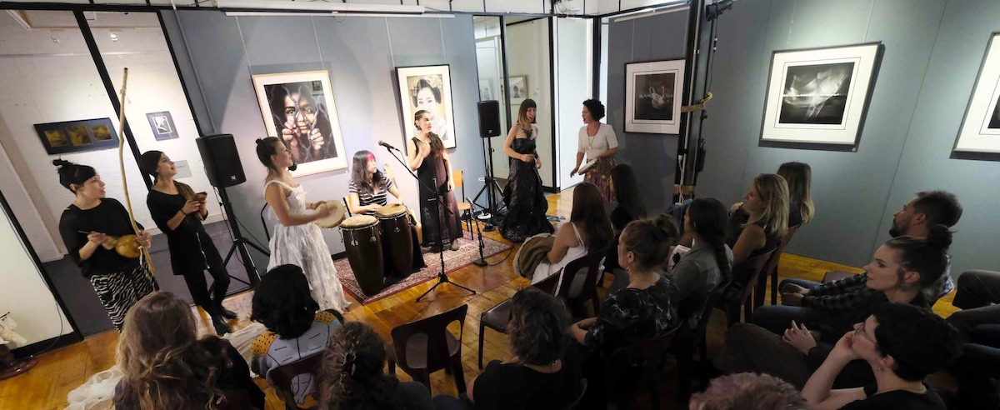
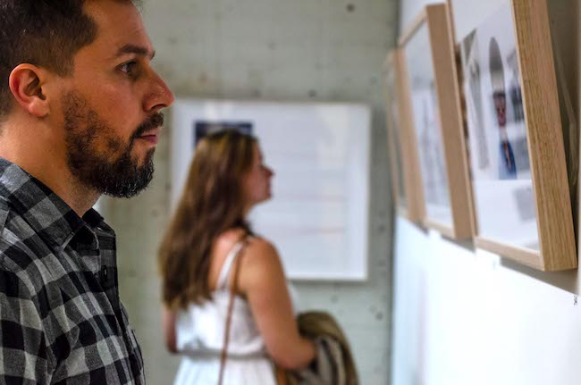
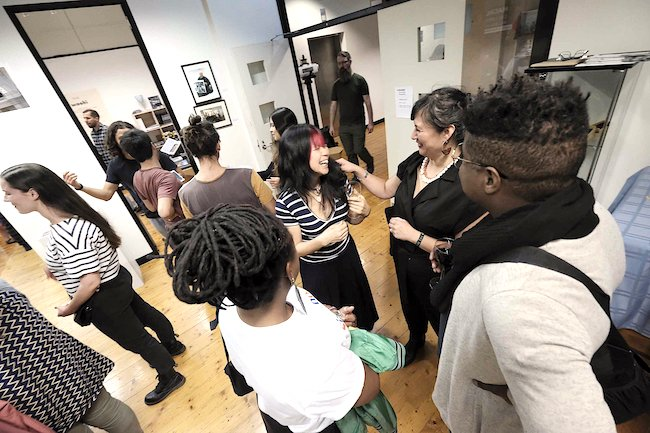
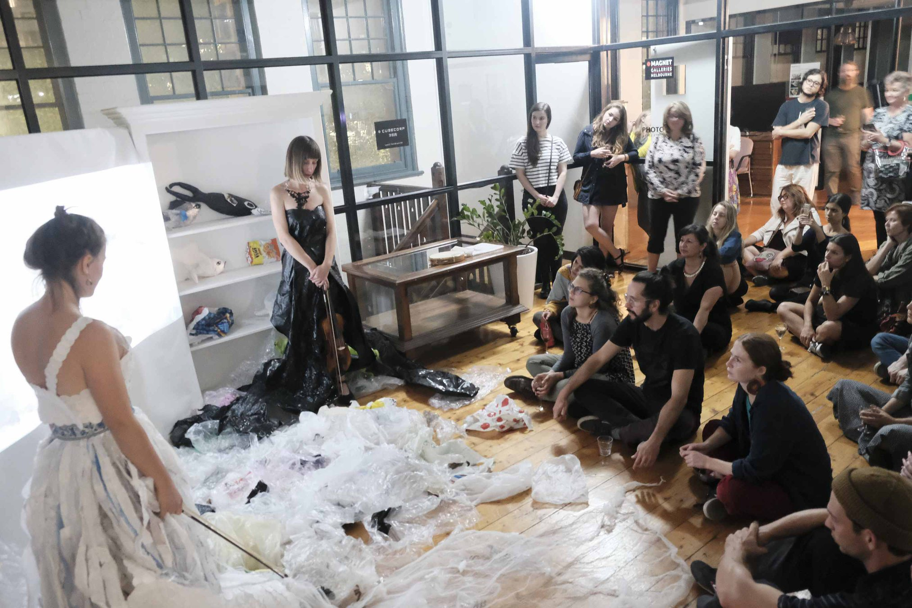
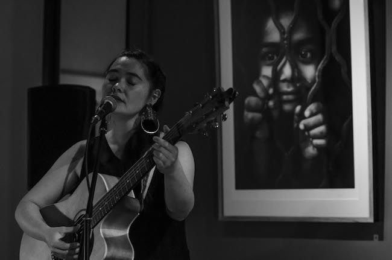
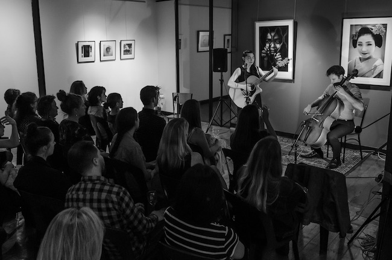
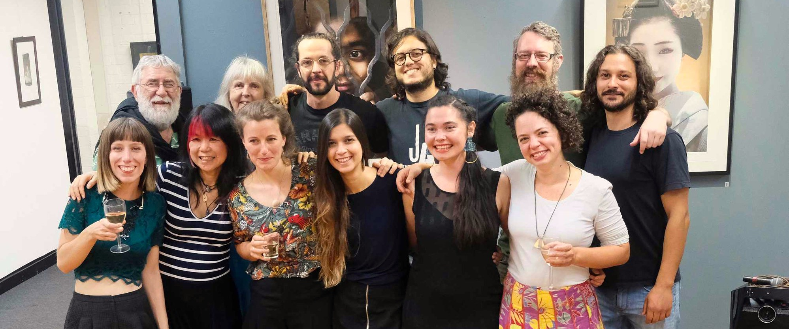

<figure class="figure float-right ml-3 mb-3">

  <figcaption class="figure-caption mt-1">Photo by Igor Dallegrave</figcaption>
</figure>

## Women in the Spotlight

The third edition of ‘Live in the Gallery’ celebrated women in the Arts! 
Female photographers, singers, composers, dancers, actors, musicians, fashion designers got together to share an inspiring show with the audience. 
Music, poetry, dance were dialoguing with the astonishing photo exhibition ‘Songs of Innocence’ - 2019 women photographers’ exhibition. 

## Poetry

‘Songs of Innocence’ photo exhibition was inspired on English poet William Blake’s highly political poem collections “Songs of Innocence and Experience”. Written in the early 19th Century, at the height of the Industrial Revolution, these poems provide a biting commentary on the essential innocence of childhood and its abuse by an industrialised society. 
This theme was interpreted by the photographers in many ways – philosophy, symbolism, abstract, documentary, polemic - to produce a varied and illuminating commentary on our times.
Susanne Silver invited the audience to connect deeply with the exhibition by reciting some the Blake’s poems on the night and guiding audience through the exhibition.  
Susanne finds his poems so relevant to our society now (even though they were written in 1789). ‘Blake express the innocence of childhood and how it is perverted by society (in his day he was talking about sacrificing childhood to the needs of the industrial revolution in Britain and the repressiveness of society, church and state upon innocence. Nowadays many things pervert and destroy childhood – institutional abuse of children, technology, social media, society’s attitudes and addictions – resulting in mental health problem for so many young people’ Says Susanne.

## Colourful Collective

Colourful Collective is a startup social enterprise tackling the problem of plastic waste from all angles, with the aim of providing meaningful employment for marginalised community members. For 'Women in the Spotlight' they presented an adaptation from their multidisciplinary, awareness-raising performance 'DEBRIS' which debuted in November 2018. This adaptation was a short film created in collaboration with dancer Julia Calasso and was accompanied by live improvisation from performers dressed in artistic costumes handcrafted from plastic waste.[More about Colourful Collective](https://www.colourfulcollective.org)

## Imogen Pemberton

Imogen Pemberton playing her original tunes was the main act of the night!
She mesmerised the audience with her broad vocal range, soaring melodies and sophisticated guitar playing. Within her folk ballads she touched on many genres but always stayed true to her own unique sound. 
Her pure organic tone and honesty within her lyrics displays a maturity beyond her years that reaches listeners on a personal level.
Imogen performed alongside the very talented cellist Oliver Downes. Together the dynamic duo presented a hauntingly beautiful soundscape that both nourished the souls and broke the hearts.[More About Imogen Pemberton](https://www.facebook.com/ImogenPmusic/)

  <figure class=" col-lg-12 col-md-12">
      
  </figure>
  <figure class=" col-lg-6 col-md-6">
      
  </figure>
  <figure class=" col-lg-6 col-md-6">
      
  </figure>
  <figure class=" col-lg-12 col-md-12">
      
  </figure>
  <figure class=" col-lg-6 col-md-6">
      
  </figure>
  <figure class=" col-lg-6 col-md-6">
      
  </figure>
  
  <figure class=" col-lg-12 col-md-12">
      
      <figcaption class="figure-caption mt-1">Crew from top bottom left to right: Michael Silver, Susanne Silver, Marcelo Garcia, Alcides Neto, Daniel Silver, Igor Dallegrave, Alex Childs, Kana Sakai, Sophie Dahm, Clarens Sanchez, Imogen Pemberton, Julia Calasso</figcaption>
  </figure>

    
 <h2 class="content-subhead">Cast and Creatives</h2>     

<dl class="row">
  <dt class="col-6">Concept &amp; Director</dt>
  <dd class="col-6">Julia Calasso</dd>

  <dt class="col-6">Photographer</dt>
  <dd class="col-6">Michael Silver, Igor Dallegrave</dd>

  <dt class="col-6">Performers</dt>
  <dd class="col-6">Susanne Silver, Alex Childs, Sophie Dahm, Kana Sakai, Clarens Sanchez, Imogen Pemberton, Julia Calasso, Veronica Galvan</dd>

  <dt class="col-6">Musicians</dt>
  <dd class="col-6">Imogen Pemberton & Oliver Downes</dd>

  <dt class="col-6">Sound Engineer</dt>
  <dd class="col-6">Alcides Neto</dd>

</dl>

