## UniVerses
'UniVerses' was an international spoken word that invited audience to travel to 13 different countries through the sounds of mother language. The event brought together 15 performers from 13 different nationationaties to express themselves by reciting poems or storytelling in their first languages. 
The amount of passion each one of the guests expressed was magical creating an unforgetable experience.
Our very special guest Renaud Gay included the musical element to the night and it made audience and performers opened up their hearts and fly. 
Spoken Word was the dialogue whilst two remarkable photo exhibitions were presented at the gallery space. 

## Performers

  

    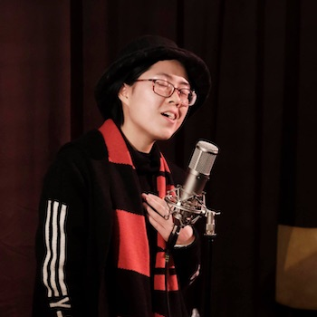
    <h5 class="py-3">Anyi Yuan</h5>
    
is originally from China and speaks Mandarin, Cantonese and English.
She is an amateur singer & songwriter and loves dancing, playing guitar and all kinds of
sports. She enjoys interacting with people from different backgrounds sharing experiences and stories.
She is open to all kinds of arts forms and she believes that she is a good storyteller with
her music because she is just ‘herself’
    

  

  
    

    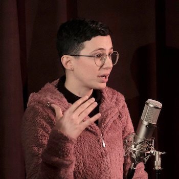
    <h5 class="py-3">Vasiliki Tsouka</h5>
    
is an arts professional and dramaturg based in Melbourne. She was
born and grew up in Athens, Greece where she completed a bachelor’ s in Cultural studies
and management. She has worked for numerous arts spaces, artists, publishing houses,
festivals as part of the production and press office. Her vision is to combine her love and
knowledge for the Ancient Greek Theatre with Australian as well as international modern
narratives
    

  

  

    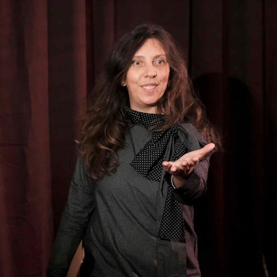
    <h5 class="py-3">Cathleen Gay</h5>
    
was born in Melbourne, Australia and she grew up in Provence and
studied in Paris, France. Dance, Music, Art and Fashion have always been a passion for
her. She comes from Fashion Haute Couture where she was trained and she worked many years for prestigious brands and different sectors in this field. She has lived in Shanghai, China for 10 years and now she is back to her birth land, Melbourne where she teaches Fashion Design, provides Consulting and continues her Artistic work and collaborations as a multidisciplinary and
transversal designer with textile, drawing, graphic and photo as her main tools of expression.
    

  

    

    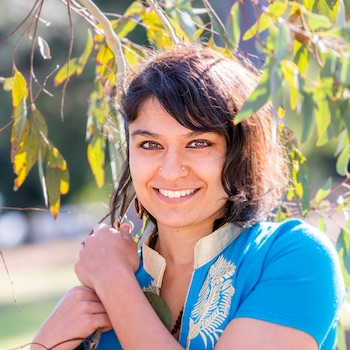
    <h5 class="py-3">Lalita Ramona Yagnik</h5>
    
is a Kalari Healing Practitioner, Naturopath, Martial Arts and
Yoga instructor. She is the director of Kalari Healing, which provides integrated health
services and martial arts/yoga, and which synergises traditional and evidence based
medicine.
Originally from India, Lalita has lived in various countries such as Brazil, Singapore, India
and Japan. Her father is a Gujarati from northern India, and mother from Goa in the south.

She speaks fluent English, Spanish and Portuguese, and understands Japanese and
Hindi. Her father speak Hindi, Gujarati, Wagadi and Mewadi, the later two indigenous
dialects from the north west.
    

  

  

    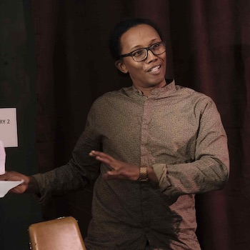
    <h5 class="py-3">Fabrice Ginap</h5>
    
is originally from Martinique Island and carrys within his Afro-Caribean heritage. This includes Creole Tales, dances and an unique perspective of life. He engages multicultural audiences as a citzen of the world where current and ancient uplifing cellebrations ememrges.
    

  

  

    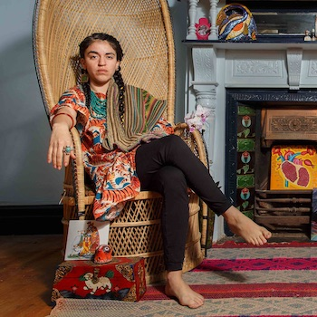
    <h5 class="py-3">Grace de las Nieves</h5>
    
 was born in Santiago de Chile, under the family Amigo Perez,
a mixture of Spanish blood and Mapuche people where her family comes from. She has
always found beauty in the Spanish language that creates her universe. She still dancing
the fight
    

  

  

    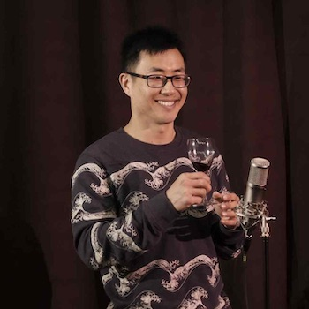
    <h5 class="py-3">Johnny Niu</h5>
    
(Chinese name Xiaoming) is originally from Shandong in China where
they speak Mandarin. He moved to Australia in 2008 and explorers his creative mind
through coding softwares. He enjoys calisthenics, reading and travelling and wishes to
have diversity in his life by trying different activities, exploring more places and different
cultures around the world
    

  

  
  

    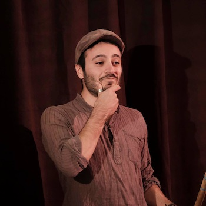
    <h5 class="py-3">Stefano Mangiola</h5>
    
was born in Milan (Italy), from a family emigrated from the south of
Italy (Calabria and Puglia). He grew up in between the north and south cultures. From
childhood he was passionate about Music and Science. Growing up, he kept both doors
opened hoping that one day he would have choose the right one, for then understanding
that he was quite comfortable in the anteroom
    

  

    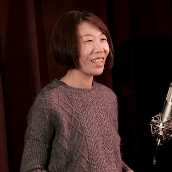
    <h5 class="py-3">Soyoun</h5>
    
was born in Incheon, the town near the Western Sea in South Korea where
they speak Korean; Hangeul, 한글. She has moved to Australia in 2005 to pursue her
creative career and she is currently working as a photo-media artist and independent
curator
    

  

  

    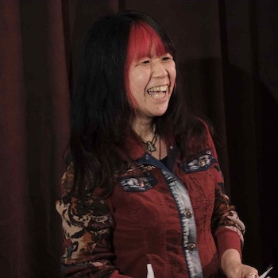
    <h5 class="py-3">Kana Sakai</h5>
    
 was born and grew up in Japan. Her childhood dream to live abroad led her way to NZ and Australia and now has been teaching Japanese at primary schools in Australia over 20 years. Keeping Australia as her base, she has also been pursuing her passion for travelling the world and also another passion towards Afro latin music, especially Brazilian.  Now she counts Australia as her home, Japan as home of her heart and Brazil as home of her soul.      

  

  

    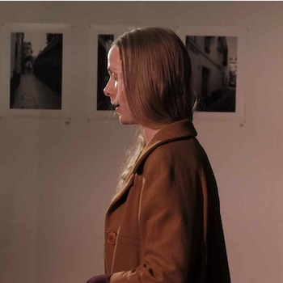
    <h5 class="py-3">Chloe</h5>
    
 feels privileged to be living on Kulin Land. Her ancestors are English/Irish/
Scottish/German and she describes them and herself as settler/invaders of this country
known as Australia. She is an artist and loves listening and drawing. Poetry, she feels, is
an embodied practice of being inside a drawing, listening.
    

  

  

    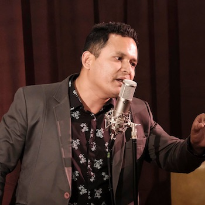
    <h5 class="py-3">Arjady Martinez</h5>
    
is Peruvian Colombian and has been writing poetry for the last 20
years. He writes about love, passion and perspectives of life.
    

  

  

    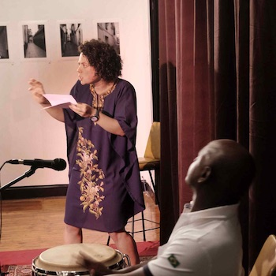
    <h5 class="py-3">Julia Calasso &amp; Edval Boa Morte</h5>
    
Julia Calasso is a performance artist originally from Brazil, based in Melbourne who
loves storytelling and dancing. She perceives art as a powerful tool to question aspects of
our society and to propose alternatives.

Edval Boa Morte "Mestre Val Boa Morte' is a reference in different areas of Brazilian culture. He is a Capoeira
Master and a Brazilian drumming expert and has been travelling around the world since
1983 performing Brazilian Culture.
    

  

  

    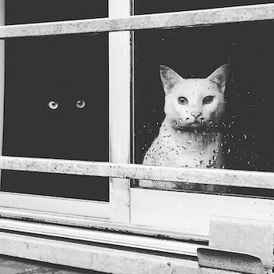
    <h5 class="py-3">Dmitry Meow</h5>
    
 is originally from Kazakhstan where they speak Russian and Kazakh.
He moved to Australia with his family 7 years ago and find the best way to explore his
creativity in coding. Passionate about cats he perceives the world around him as magical
playground.

  

  

    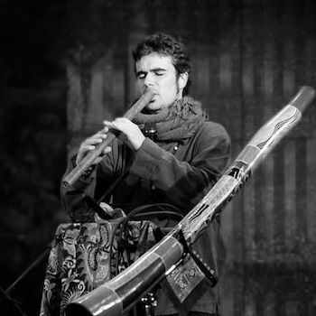
    <h5 class="py-3">Renaud Gay</h5>
 
Renaud is a French performer and composer, founder of SoundScape, focusing on
the contemporary use of traditional instruments. Renaud has played in various bands,
venues and with different artists from around the world.
He had been playing guitar/bass in first place for 10 years before life brought him to the
realms of World Music.

Didgeridoo , jaw harp and throat singing were the first instruments he learnt and played for
more than 18 years. He started then the practice of the Rajasthani/Pakistani double flutes
“Algoza/Satara” 15 years ago, then other traditional instruments such as Persian Ney,
Moroccan Guembri, Indonesian Suling... that Renaud has already incorporated in
SoundScape as well as in other collaborations.
Driven by his love of traditional instruments, he has since started to learn other
instruments such as Dilruba and Ravanhatta.
Renaud believes that traditional instruments are the living memories of mankind’s cultural
heritage. They express the deepest interactions between men and environment they live
in.

  

    <figure class=" col-lg-12 col-md-12">
      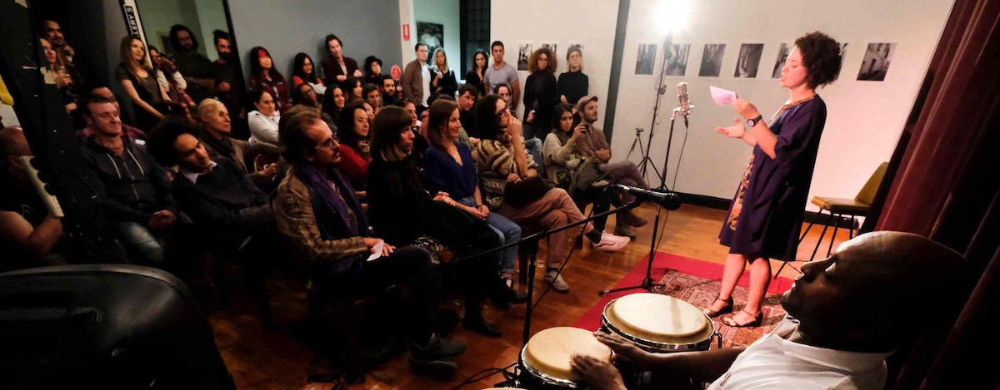
  </figure>
  <figure class=" col-lg-6 col-md-6">
      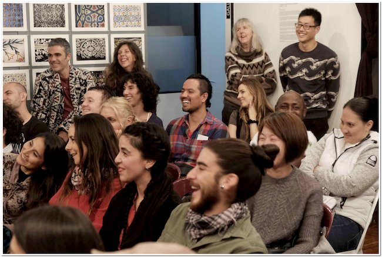
  </figure>
  <figure class=" col-lg-6 col-md-6">
      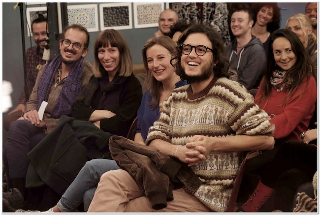
  </figure>
  <figure class=" col-lg-12 col-md-12">
      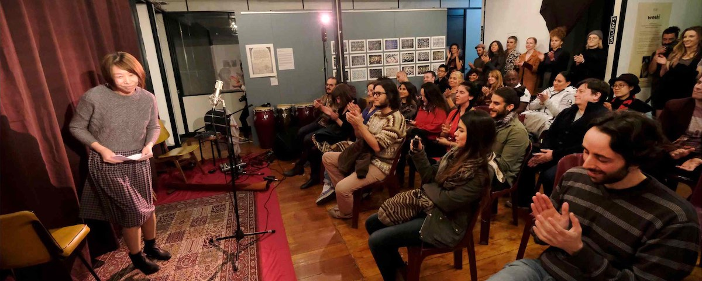
  </figure>
  

    
 <h2 class="content-subhead">Cast and Creatives</h2>     

<dl class="row">
  <dt class="col-6">Concept, Producer &amp; Director</dt>
  <dd class="col-6">Julia Calasso</dd>

  <dt class="col-6">Photographer</dt>
  <dd class="col-6">Michael Silver</dd>

  <dt class="col-6">Performers</dt>
  <dd class="col-6">Anyi Yuan, Cathleen Gay, Fabrice Ginap, Grace de las Nieves, Soyoun, Stefano Mangiola, Kana Sakai, Chloe, Johnny Niu, Vasiliki Tsouka, Lalita Ramona Yagnik, Arjady Martinez, Julia Calasso, Dmitry Meow</dd>

  <dt class="col-6">Musicians</dt>
  <dd class="col-6">Renaud Gay, Edval Boa Morte</dd>

  <dt class="col-6">Sound Engineer</dt>
  <dd class="col-6">Alcides Neto</dd>

</dl>
