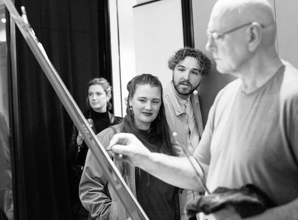
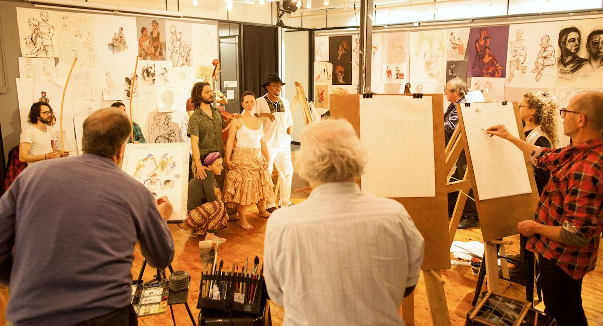
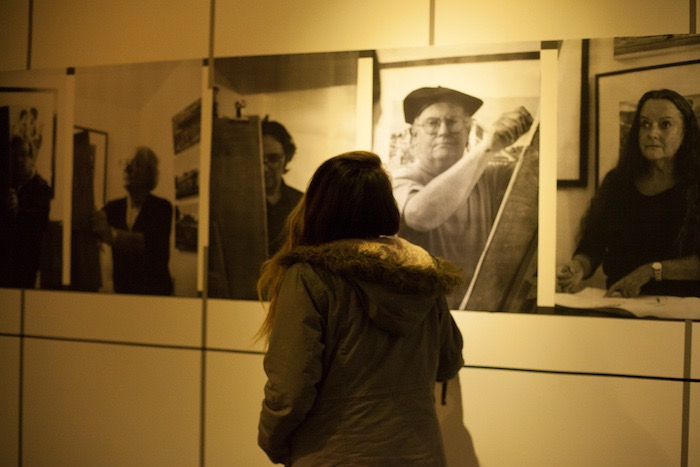
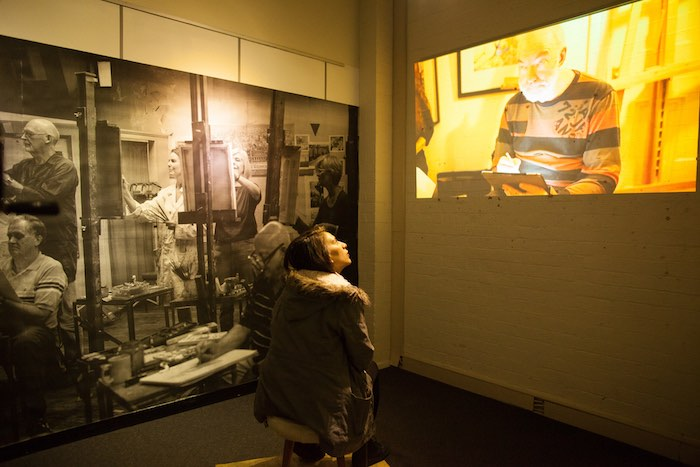
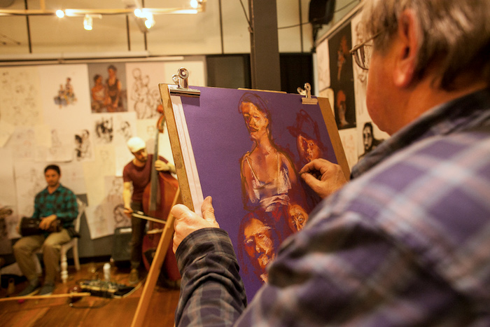
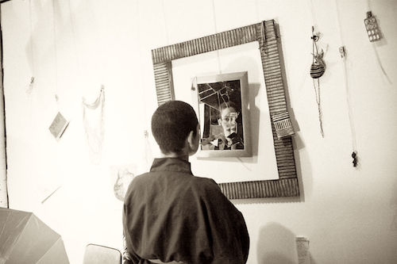
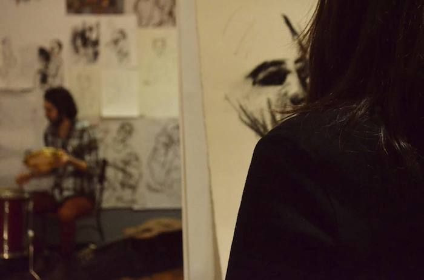
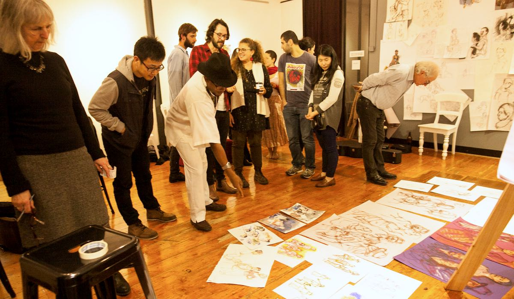

Perspectiva Exhibition was a living exhibition that explored the
connection between Artists and Life Models, from the Model’s
perspective.
The exhibition subverted perspectives in the fine arts and
explored the theme through the eyes of the model, rather than
the artist. Through two different art installations and live
performances, the audience was able to experience what it was
to be observed and described by the artists, and also to
observe themselves.
The audience was asked: How is it to be observed?; How is it
to be described?; How do you perceive your persona, your
image?
During the ten days of the exhibition, there were four life
drawing sessions, including live music. Models, artists, and
musicians were performing and interacting together. All art
work produced in the sessions, was hung on the wall at the end
of each session in front of the audience.
The exhibition took place at the Magnet Gallery in Melbourne,
and hosted approximately 150 visitors.

  <figure class=" col-lg-12 col-md-12">
      
  </figure>
  <figure class=" col-lg-6 col-md-6">
      
  </figure>
  <figure class=" col-lg-6 col-md-6">
      
  </figure>
  <figure class=" col-lg-4 col-md-4">
      
  </figure>
  <figure class=" col-lg-4 col-md-4">
      
  </figure>
  <figure class=" col-lg-4 col-md-4">
      
  </figure>
  <figure class=" col-lg-12 col-md-12">
      
  </figure>

    
 <h2 class="content-subhead">Cast and Creatives</h2>     

<dl class="row">
  <dt class="col-6">Concept &amp; Director</dt>
  <dd class="col-6">Julia Calasso</dd>

  <dt class="col-6">Photographer</dt>
  <dd class="col-6">Mariane Gonçalves</dd>

  <dt class="col-6">Art Installations</dt>
  <dd class="col-6">Julia Calasso, Marcelo Garcia &amp; Mariane
Gonçalves</dd>

  <dt class="col-6">Performers</dt>
  <dd class="col-6">Julia Calasso, Emma Stone, Vivienne Liling
Wong, Igor Dellagrave, Fernanda Vilella, Fabrice Ginape</dd>

  <dt class="col-6">Artists Invited</dt>
  <dd class="col-6">Brian Pieper, Veronica Petelin, Sophie Sardi, Daniela Sonksen, Travis 
Vella, Carmen Olsen, Alex Childs, Tanleea Valestro, Patrick
Loverson, Geoff Coleman, Mick Connolly, Glenda Mathews,
Revell Philips, Gary Cassidy</dd>

  <dt class="col-6">Musicians</dt>
  <dd class="col-6">Marcelo Garcia, Stefano Vespucci, Alex Childs,
Aiden Kennedy, Tide, Gibran Daoud, Tiago Brissos, Sophie Dahm, Damiano Spina</dd>

  <dt class="col-6">Sound Engineer</dt>
  <dd class="col-6">Alcides Neto</dd>

  <dt class="col-6">Graphic Designer</dt>
  <dd class="col-6">Filipe Piçarro</dd>

  <dt class="col-6">Special Thanks to the Magnet’s family and friends</dt>
  <dd class="col-6">Michael
Silver, Susanne Silver &amp; Daniel Silver, Gary Chan, Kelly
Zephyr, Andrew Forsythe, Adam Brunskill, Fernanda Quilici</dd>
</dl>
