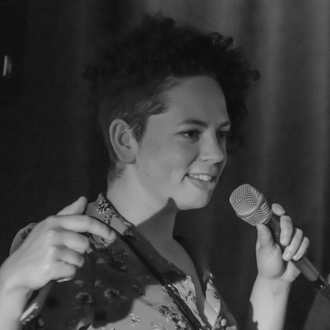

## Who we are

<figure class="figure float-right ml-3 mb-3">
  
</figure>

I am Julia, I am originally from Brazil, I migrated to Australia in 2013. I am trained as an actress and the themes of identity, multiculturalism and inclusion have always nurtured my artistic endeavours, however, my own experience living everyday life as a migrant in Australia brought these themes to the core of my work. The need to adapt and reinvent myself as an arts practitioner made me expand my skills by stepping into roles such as: creative producer, artistic director, emcee, arts programmer and performer. I also completed a Masters in Arts Management in 2019. 

I am fascinated by the power of storytelling. When we share our own stories we open ourselves up to multiple worlds and expose the poetry of our own journeys to each other. We understand how rich and fortunate we are to live in such a diverse society. I am passionate about multiculturalism and social justice. The arts offer culturally and linguistically diverse communities tools for shining our own light into the world, reclaiming our agency, and our capacity to influence and participate in society.

In 2016 I created Always Uneven driven by an urge to promote an inclusive community of creatives, and by the desire to take artists to new spaces to develop a multidisciplinary and culturally diverse arts projects. 

For me creative arts has to question society and provoke critical thinking. I strongly believe that true inclusivity will happen when we see the diversity of festivals line-ups and programs reflected in the management structures of the arts industry. 

