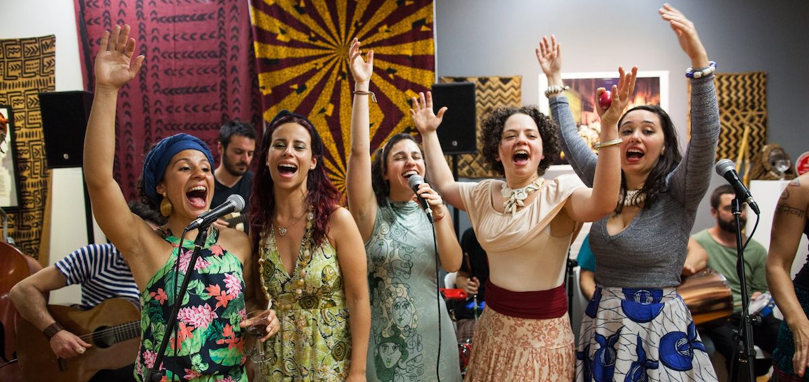

  
Women of Samba was an exhibition that discussed the woman’s role in the Brazilian samba culture. Instead of the sexualized naked bodies, covered in glitter and feathers, women have a much deeper/ presence in the popular Brazilian culture. 
The exhibition presented the art works by the Brazilian artist Anita Ekman, and also had four live performances to present and discuss the theme. The exhibition was on for 26 days at the Magnet Gallery in Melbourne, during the months of August and September 2016. Exhibition hosted approximately 400 visitors. 
On the opening night, four female singers sang traditional Brazilian samba songs, with a full samba band. The infectious dance and joy were central to evening. 
The second live event presented Capoeira, the Brazilian martial art, showing its connection to the samba culture.
The third event was a special performance for 25 students aged between 10 and 13 years old. Most of the students were originally from Africa, and they were able to see how their culture travelled around the world and influenced other cultures. 
The last performance reproduced a traditional samba jam session. Here, musicians, singers and dancers get together to play and sing without rehearsing, celebrating the culture of samba and life.

----

  <figure class=" col-lg-12 col-md-12">
      
  </figure>
  <figure class=" col-lg-6 col-md-6">
      
  </figure>
  <figure class=" col-lg-6 col-md-6">
      
  </figure>

    <figure class=" col-lg-6 col-md-6">
      
  </figure>
  <figure class=" col-lg-6 col-md-6">
      
  </figure>
  

    

      Photography: Mariane Gonçalves 
    

  

[More photos Opening Night](https://www.facebook.com/pg/alwaysuneven/photos/?tab=album&album_id=446216882789582)
[More photos Capoeira](https://www.facebook.com/pg/alwaysuneven/photos/?tab=album&album_id=446234429454494)
[More photos Closing Ceremony](https://www.facebook.com/pg/alwaysuneven/photos/?tab=album&album_id=446275182783752)

## Cast and Creatives

<dl class="row">
  <dt class="col-6">Artist Exhibiting</dt>
  <dd class="col-6">Anita Ekman</dd>

  <dt class="col-6">Guest Artist (African textiles)</dt>
  <dd class="col-6">Watiri Boylen<dd>

  <dt class="col-6">Concept, Curation and Production</dt>
  <dd class="col-6">Anita Ekman &amp; Julia Calasso <dd>    
  
  <dt class="col-6">Artistic Director</dt>
  <dd class="col-6">Julia Calasso <dd>    

  <dt class="col-6">Photographer</dt>
  <dd class="col-6">Mariane Gonçalves<dd>    

  <dt class="col-6">Singers &amp; Musicians</dt>
  <dd class="col-6">Luciana Carvalho, Laura Souza, Julia Calasso, Juliana Tenucci, Lalita Ramona, Fernanda Vilela, Jairo
Nascimento, Nelson Cardoso,  Luiz Sasson, Marcelo Garcia, Damiano Spina, Stefano Vespucci, João
Oliveira, Tiago Ucella, Igor Delagrave<dd>  

  <dt class="col-6">Special Thanks to the Magnet&#39;s family and friends </dt>
  <dd class="col-6">Michael Silver, Susanne Silver, Daniel Silver, Gary
Chan. Thank you for the Capoeira community in Melbourne and Freg J. Stokes<dd> 
<dl>  
